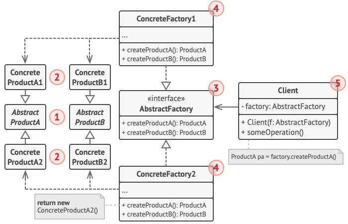

# Abstract Factory
## Structure

1. Abstract Products declare interfaces for a set of distinct but related products which make up a product family.
2. Concrete Products are various implementations of abstract products, grouped by variants. Each abstract product (chair/sofa) must be implemented in all given variants (Victorian/Modern).
3. The Abstract Factory interface declares a set of methods for creating each of the abstract products.
4. Concrete Factories implement creation methods of the abstract factory. Each concrete factory corresponds to a specific variant of products and creates only those product variants.
5. Although concrete factories instantiate concrete products, signatures of their creation methods must return corresponding abstract products. This way the client code that uses a factory doesn’t get coupled to the specific variant of the product it gets from a factory. The Client can work with any concrete factory/product variant, as long as it communicates with their objects via abstract interfaces.

## Benefits and use-cases
- separates the *client code* (code that uses **Product** objects) from *product construction code*
- Provides a way to extend the code easily (by adding new **Concrete creator**) and a new **Product**
- makes sure that the factory will produce **Products** that are compatible with each other 

## Dangers
- Introduces many new classes and can make the code more complicated

## How to implement
 
1. Map out a matrix of distinct product types versus variants of these products.
2. Declare abstract product interfaces for all product types. Then make all concrete product classes implement these interfaces.
3. Declare the abstract factory interface with a set of creation methods for all abstract products.
4. Implement a set of concrete factory classes, one for each product variant.
5. Create factory initialization code somewhere in the app. It should instantiate one of the concrete factory classes, depending on the application configuration or the current environment. Pass this factory object to all classes that construct products.
6. Scan through the code and find all direct calls to product constructors. Replace them with calls to the appropriate creation method on the factory object.

## Source 
* [refractoring.guru](https://refactoring.guru/design-patterns/abstract_factory)