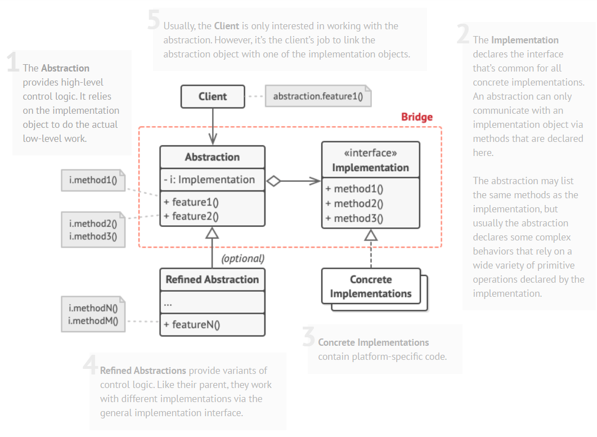

# Bridge
## Structure

## Benefits and use-cases
- **Use the Bridge pattern when you want to divide and organize a monolithic class that has several variants of some functionality (for example, if the class can work with various database servers)**
  
- **Use the pattern when you need to extend a class in several orthogonal (independent) dimensions**
- **Use the Bridge if you need to be able to switch implementations at runtime**
- You can create platform-independent classes and apps.
- The client code works with high-level abstractions. It isn’t exposed to the platform details.
- Open/Closed Principle. You can introduce new abstractions and implementations independently from each other.
- Single Responsibility Principle. You can focus on high-level logic in the abstraction and on platform details in the implementation.
  
## Dangers
- You might make the code more complicated by applying the pattern to a highly cohesive class.
  
## How to implement
1. Identify the orthogonal dimensions in your classes. These independent concepts could be: abstraction/platform, domain/infrastructure, front-end/back-end, or interface/implementation.
   
2. See what operations the client needs and define them in the base abstraction class.
3. Determine the operations available on all platforms. Declare the ones that the abstraction needs in the general implementation interface.
4. For all platforms in your domain create concrete implementation classes, but make sure they all follow the implementation interface.
5. Inside the abstraction class, add a reference field for the implementation type. The abstraction delegates most of the work to the implementation object that’s referenced in that field.
6. If you have several variants of high-level logic, create refined abstractions for each variant by extending the base abstraction class.
7. The client code should pass an implementation object to the abstraction’s constructor to associate one with the other. After that, the client can forget about the implementation and work only with the abstraction object.
   
## Source 
* [refractoring.guru](https://refactoring.guru/design-patterns/bridge)