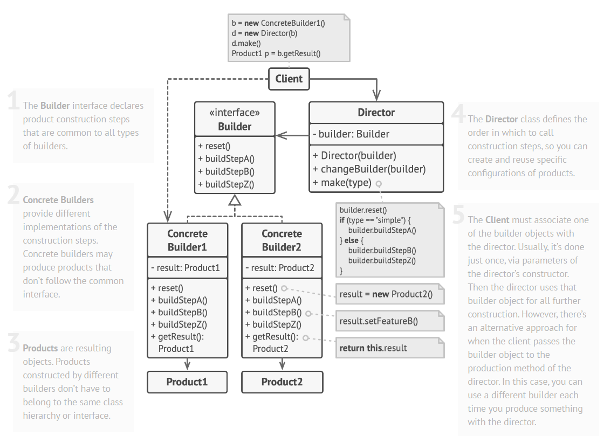

# Builder
## Structure

## Benefits and use-cases
- should be used to avoid overloading constructors with tons of different parameters
- should be used if you have different representations of the same product that is built in a certain way (e.g. car and its manual or stone and wooden houses)
- You can reuse the same construction code when building various representations of products.
- You can construct objects step-by-step, defer construction steps or run steps recursively

## Dangers
- Introduces many new classes and can make the code more complicated

## How to implement
1. Make sure that you can clearly define the common construction steps for building all available product representations. Otherwise, you won’t be able to proceed with implementing the pattern.
2. Declare these steps in the base builder interface.
3. Create a concrete builder class for each of the product representations and implement their construction steps.
    
    Don’t forget about implementing a method for fetching the result of the construction. The reason why this method can’t be declared inside the builder interface is that various builders may construct products that don’t have a common interface. Therefore, you don’t know what would be the return type for such a method. However, if you’re dealing with products from a single hierarchy, the fetching method can be safely added to the base interface.
4. Think about creating a director class. It may encapsulate various ways to construct a product using the same builder object.
5. The client code creates both the builder and the director objects. Before construction starts, the client must pass a builder object to the director. Usually, the client does this only once, via parameters of the director’s class constructor. The director uses the builder object in all further construction. There’s an alternative approach, where the builder is passed to a specific product construction method of the director.
6. The construction result can be obtained directly from the director only if all products follow the same interface. Otherwise, the client should fetch the result from the builder.

## Source 
* [refractoring.guru](https://refactoring.guru/design-patterns/builder)