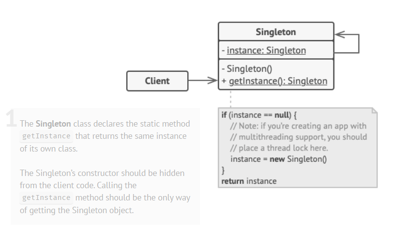

# Builder
## Structure

## Benefits and use-cases
- The singleton object is initialized only when it’s requested for the first time
- Use the Singleton pattern when a class in your program should have just a single instance available to all clients; for example, a single database object shared by different parts of the program
- Use the Singleton pattern when you need stricter control over global variables.
  
## Dangers
- It may be difficult to unit test the client code of the Singleton because many test frameworks rely on inheritance when producing mock objects
- The pattern requires special treatment in a multithreaded environment so that multiple threads won’t create a singleton object several times
- Violates the *Single Responsibility Principle*. The pattern solves two problems at the time
- The Singleton pattern can mask bad design, for instance, when the components of the program know too much about each other

## How to implement
1. Add a private static field to the class for storing the singleton instance.
   
2. Declare a public static creation method for getting the singleton instance.
3. Implement “lazy initialization” inside the static method. It should create a new object on its first call and put it into the static field. The method should always return that instance on all subsequent calls.
4. Make the constructor of the class private. The static method of the class will still be able to call the constructor, but not the other objects.
5. Go over the client code and replace all direct calls to the singleton’s constructor with calls to its static creation method.

## Source 
* [refractoring.guru](https://refactoring.guru/design-patterns/singleton)